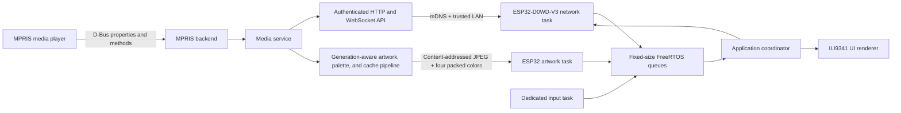
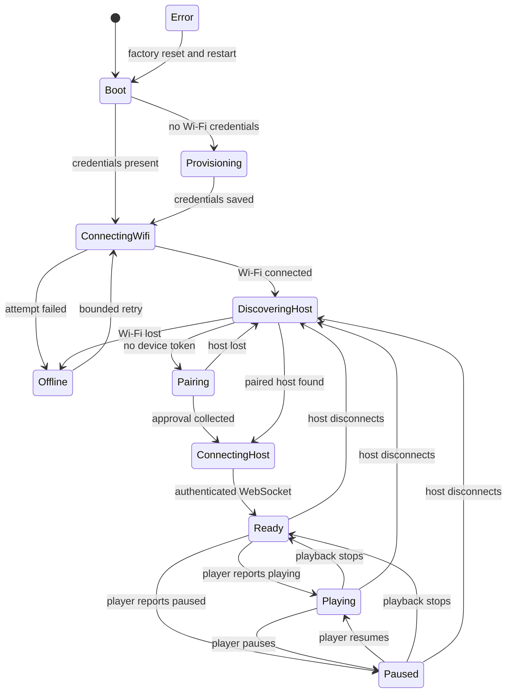

# DeskWave architecture

DeskWave deliberately splits desktop integration from the embedded product.
The ESP32 never automates application windows or embeds service-specific cloud
credentials. DeskWave Host translates standard Linux media APIs into a small,
versioned device protocol.

## Repository boundaries

| Area | Responsibility |
| --- | --- |
| `host/backends` | Media-provider abstraction and MPRIS/D-Bus implementation |
| `host/service` | Normalized state, artwork association, commands, subscriber fan-out |
| `host/api` | Pairing, bearer authentication, HTTP, WebSocket sessions, rate limits |
| `host/artwork.py` | SSRF-aware retrieval, validation, resizing, palette extraction, atomic bundle cache |
| `host/storage.py` | Pairing and device-token hash persistence in SQLite |
| `firmware/lib/deskwave_core` | Platform-independent state, input, progress, backoff, pin rules |
| `firmware/src/network` | Provisioning, discovery, pairing, protocol, reconnect, artwork download |
| `firmware/src/controls` | GPIO polling, debounce, long/repeat gestures, event publication |
| `firmware/src/app` | Queue ownership, control policy, optimistic feedback, settings, health |
| `firmware/src/ui` | Screen state, transitions, overlays, layout, JPEG presentation |
| `firmware/src/display` | The only LovyanGFX panel/bus/backlight configuration |
| `firmware/src/storage` | Versioned NVS settings and migration |

## Host process

DeskWave Host is one asyncio process in the desktop user's session.

1. `MPRISBackend` connects to the session D-Bus, scans for
   `org.mpris.MediaPlayer2.*`, snapshots normalized properties with bounded
   timeouts, and applies deterministic active-player selection.
2. `MediaService` owns the current `PlaybackState` and the artwork update
   generation. Each subscriber receives a queue of size one, so a slow device
   receives the newest state instead of an unbounded history. The last valid
   artwork/theme tuple is retained across position updates, pause, temporary
   missing `mpris:artUrl`, and short backend reconnects.
3. `ArtworkCache` handles `file://`, HTTP, and HTTPS sources outside the event
   loop when retrieval or decoding is blocking/CPU-bound. It validates the
   complete source, center-crops and encodes a 320×320 JPEG, extracts a
   contrast-corrected four-color theme, hashes the rendered bytes, and
   atomically commits a content-addressed JPEG plus schema-1
   `<artwork_id>.palette.json` sidecar. Temporary remote failures receive three
   total attempts with 250 ms then 750 ms backoff; successful bundles are reused
   without repeating conversion or palette extraction.
4. aiohttp serves health, pairing, artwork, player-list, and WebSocket routes.
   Pairing routes are the only unauthenticated device operations and are
   rate-limited. Every other device route requires a valid bearer token.
5. `DiscoveryService` advertises `_deskwave._tcp.local.` with protocol and path
   TXT properties. Discovery failure is non-fatal because a saved firmware host
   override remains possible.

Backend calls have a service-level 2.5-second timeout and MPRIS calls have
tighter operation-specific timeouts. The backend reconnects to D-Bus with a
bounded delay after desktop suspend, session restart, or bus failure.

### Artwork transaction ownership

Artwork work is keyed by track/update generation, not by URL alone: MPRIS
players may reuse one local path and overwrite its contents on every track.
Starting newer work invalidates the older context. Completion checks the
generation again before publishing, so cancellation is an optimization rather
than the correctness boundary and a late result can never overwrite the active
track.

A new track whose `mpris:artUrl` is temporarily absent enters a 1.0-second grace
window while the previous validated tuple and promoted generation remain
published. Each new intent reserves a nonzero 32-bit generation; once a source
is available, artwork and palette are produced and promoted together. If the
grace expires without a source, or bounded processing proves the source is
unusable, the service promotes the deliberate fallback tuple. Abandoned
rapid-skip intents can leave harmless generation gaps. Sanitized debug logs
record each generation, grace, attempt, retry, cache decision, rejection, and
fallback without exposing bearer tokens or full media-library URLs.

## Firmware execution model

The published ESP32-D0WD-V3 firmware uses four execution contexts, not one
blocking super-loop.

| Context | Core / priority | Owns | May block on |
| --- | --- | --- | --- |
| Input task | core 1 / 3 | Encoder and button trackers | Nothing; polls every 1 ms |
| Network task | core 0 / 2 | Wi-Fi, mDNS, pairing, WebSocket, protocol | Bounded Wi-Fi/HTTP operations |
| Artwork task | core 0 / 1 | LittleFS artwork cache and HTTP stream | Bounded image download |
| Arduino loop | core 1 / default | Application state, settings policy, display | Short display/JPEG rendering |

Every long-running loop yields. Network and artwork work cannot prevent the
input task from debouncing and queuing controls. The Arduino loop consumes up to
a bounded number of input events per iteration, updates the UI, then yields for
2 ms.

### Queue ownership

The producer/consumer boundary is explicit:

| Queue | Producer | Consumer | Policy |
| --- | --- | --- | --- |
| Input | Input task | Application | 32 events; warn if full |
| Playback | Network | Application | Length one; overwrite with newest |
| System notices | Network | Application | Length eight; discard oldest on overflow |
| Commands | Application | Network | Length 16; immediate visible failure if full |
| Command feedback | Network | Application | Length eight; discard oldest on overflow |
| Artwork requests | Network | Artwork | Length one; newest generation wins |
| Artwork results | Artwork | Application/UI | Length one; generation must still match; successful results require ownership acknowledgement |
| Player list | Network | Application/UI | Length one; newest list wins |

Queue messages are fixed-size structures with bounded character arrays. Tokens
are copied only across the artwork request boundary and the task wipes its local
request copy after use. Network parsing validates sizes and required fields
before copying them.

For a playback update with artwork, the network task publishes the complete
playback snapshot before it exposes the matching artwork request. This prevents
an already-cached JPEG from completing before the UI knows its generation. On a
successful artwork result, the artwork task first protects the result's exact
ID/generation, publishes it, and waits for the application task to classify it
as active, transition-staged, or stale. That acknowledgement transfers cache
ownership to the active/staged IDs atomically before the artwork task may prune
or process a newer request. Cache allocation preserves those two UI-owned files
plus the current target and reserves another 32 KiB of LittleFS headroom.

## Firmware state machine

Connection and playback state is represented by one deterministic state machine
rather than independent readiness booleans.

Wi-Fi retry and host discovery use separate bounded exponential backoff clocks
with jitter. WebSocket heartbeat frames detect dead sessions. If the HTTP health
endpoint is reachable but the saved token cannot establish a WebSocket for 30
seconds, firmware clears only the rejected pairing token and returns to pairing.

## UI state and feedback

The UI is a stateful renderer, not a network client. It receives normalized
snapshots and local actions from the application coordinator.

- Artwork is borderless and surrounded by a restrained layered edge glow. The
  primary/secondary palette tints transport, shuffle, repeat, mute, progress,
  and other action roles while the foreground/background pair preserves
  contrast.
- Now Playing removes the former full-width player header. Its enlarged 166 px
  cover and reflowed metadata occupy the reclaimed space, while only a compact
  top-right `LINK`/`RETRY` indicator remains.
- The entire exposed Now Playing canvas uses a dark, muted artwork-derived
  support color, and the CYD physical RGB light samples that final rendered
  canvas color at runtime. Firmware normalizes its channel ratios so the dark
  canvas remains visible across all three LED dies, then converts the result to
  linear LED PWM and applies per-die balance across the complete calibrated PWM
  range. The panel's saved brightness does not attenuate this separate RGB
  output. Display idle dimming explicitly reduces light intensity to one fifth;
  Error retains its red semantic override.
- UTF-8 metadata containing non-ASCII characters selects LovyanGFX's complete
  proportional Japanese font. The title renderer measures and scrolls with that
  font, while fitted labels remove whole UTF-8 code points before adding an
  ellipsis so a multibyte character is never split.
- Track changes interpolate the complete theme over 750 ms. The old cover
  remains visible until the SHA-verified replacement for the same generation
  is ready; metadata and theme changes cannot pair with a stale artwork result.
- Paused/idle presentation keeps the active palette, with reduced saturation
  and glow intensity, and interpolates back to full intensity on resume. Brief
  host rediscovery also preserves the last confirmed cover and palette.
- With no active media, Now Playing becomes a full-canvas Spotify ambient clock:
  three horizontally wrapping RGB565 wave ribbons, eight drifting particles,
  and a breathing logo halo animate in bounded top/bottom bands around a static
  12-hour time, `AM`/`PM`, and `%b/%d/%Y` date. The host sends Unix time and its
  current local UTC offset every 30 seconds; firmware advances that sample with
  `millis()` and redraws the central clock only when the minute changes.
- Progress is synchronized from host position and extrapolated from local
  monotonic time only while playing.
- Volume, transport, seek, shuffle, and repeat actions update visible state
  immediately. Confirmed host snapshots reconcile optimistic state; command
  errors produce a visible toast.
- Full-screen redraws occur only for screen/state transitions. Theme animation,
  idle ambient motion, artwork glow, progress, and connection updates use bounded dirty regions.
  JPEG decode occurs once when a verified cover is installed, never on a
  transition animation frame.
- Idle dimming changes PWM brightness without changing the saved value. Any
  physical input wakes the panel and is still processed.

The reference build is USB-flashed and has no OTA implementation. It therefore
uses Espressif's standard no-OTA table: a 2 MiB app partition accommodates the
complete Japanese font, while a 1.875 MiB LittleFS partition remains available
for the disposable artwork cache.

The Now Playing screen displays the first two upcoming entries from the
bounded MPRIS TrackList snapshot when the backend exposes queue data. The
unavailable state remains explicit for players without TrackList support. The
Device screen requests a bounded player list only while visible.

## Persistence

Firmware settings live in the `deskwave` Preferences/NVS namespace. The schema
contains Wi-Fi credentials, pairing token, brightness, default screen, idle-dim
timeout, volume step, and optional host override. Writes use validity flags so a
partially written credential/token is not treated as committed. Older schema
values are migrated and future unsupported schemas enter a controlled Error
state with the reset chord still available.

The host uses XDG paths and a WAL-mode SQLite database. Pending approvals contain
the one-time token only until the device collects it or the five-minute expiry
passes; paired-device records retain only the token hash.

## Security boundaries

- The temporary provisioning AP has a per-boot random password and form nonce.
- Pairing requires physical display access plus explicit host-side approval.
- Tokens are random, never logged, and validated on every protected route.
- WebSocket messages have version, type, sequence, size, and field validation.
- Artwork fetching blocks URL credentials, excessive redirects/bytes/pixels,
  and private/special HTTP addresses by default.
- Host cache/state permissions and the user service sandbox limit filesystem
  access.

Protocol authentication does not encrypt LAN traffic. See
[Security](../SECURITY.md) for the trust model and deployment limits.

## Failure containment

| Failure | Controlled result |
| --- | --- |
| Wi-Fi unavailable | Offline screen and backoff; no reboot loop |
| Host sleeps/restarts/moves | mDNS rediscovery and WebSocket reconnect |
| Token revoked | Health succeeds, auth fails, token cleared, pairing restarts |
| Player exits | Empty normalized state and idle/no-player screen |
| Command rejected | Command result toast; next snapshot reconciles state |
| Oversize/malformed JSON | Message rejected; host closes abusive sessions after three errors |
| Delayed/missing artwork metadata | Previous valid tuple survives the grace window; deliberate fallback follows confirmed absence |
| Artwork timeout/malformed transfer | Bounded retry, then prior cover or fallback; control path is unaffected |
| Late artwork completion | Generation mismatch is rejected before state or display commit |
| Artwork/palette cache corruption | Bundle validation fails closed and the host rebuilds it from source |
| Corrupt artwork filesystem | Only the disposable artwork partition is rebuilt |
| Corrupt/unsupported settings | Error screen; deliberate reset paths remain active |
| Low queue capacity | Newest state wins or user receives an immediate error |

## Extension points

- Add Windows/macOS providers by implementing `MediaBackend`; protocol and UI do
  not depend on D-Bus types.
- Add a different display by implementing/configuring the display boundary and
  changing only the centralized hardware profile.
- Remap controls through `ControlMapper` bindings without changing input GPIO
  logic or host command encoding.
- A future signed OTA subsystem should be a separate service with integrity and
  rollback guarantees. The `0.1.0` recovery path remains wired flashing.
